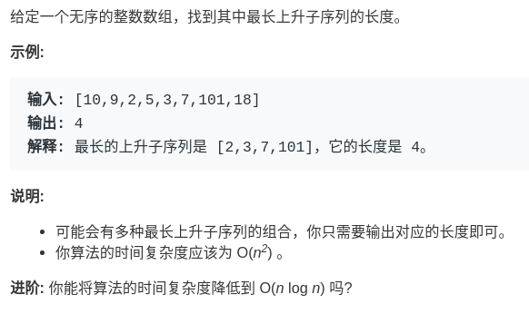
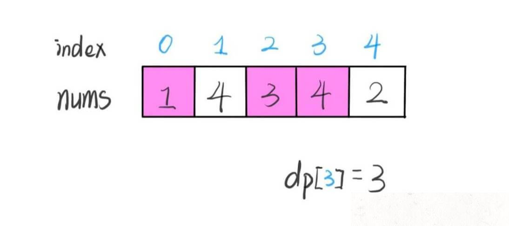
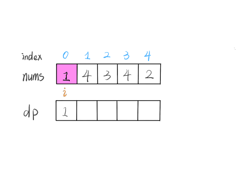

动态规划设计：最长递增子序列

也许有读者问：找到了问题的「状态」，明确了 dp 数组/函数的含义，定义了 base case；但是不知道如何确定「选择」，也就是不到状态转移的关系，依然写不出动态规划解法，怎么办？

不要担心，动态规划的难点本来就在于寻找正确的状态转移方程，本文就借助经典的「最长递增子序列问题」来讲一讲设计动态规划的通用技巧：数学归纳思想。

最长递增子序列（Longest Increasing Subsequence，简写 LIS）是非常经典的一个算法问题，比较容易想到的是动态规划解法，时间复杂度 O(N^2)
，我们借这个问题来由浅入深讲解如何找状态转移方程，如何写出动态规划解法。比较难想到的是利用二分查找，时间复杂度是 O(NlogN)，我们通过一种简单的纸牌游戏来辅助理解这种巧妙的解法。

先看一下题目，很容易理解：

注意「子序列」和「子串」这两个名词的区别，子串一定是连续的，而子序列不一定是连续的。下面先来设计动态规划算法解决这个问题。

一、动态规划解法

动态规划的核心设计思想是数学归纳法。

相信大家对数学归纳法都不陌生，高中就学过，而且思路很简单。比如我们想证明一个数学结论，那么我们先假设这个结论在 k‹n 时成立，然后根据这个假设，想办法推导证明出 k=n
的时候此结论也成立。如果能够证明出来，那么就说明这个结论对于 k 等于任何数都成立。

类似的，我们设计动态规划算法，不是需要一个 dp 数组吗？我们可以假设 dp[0...i-1] 都已经被算出来了，然后问自己：怎么通过这些结果算出 dp[i]？

直接拿最长递增子序列这个问题举例你就明白了。不过，首先要定义清楚 dp 数组的含义，即 dp[i] 的值到底代表着什么？

我们的定义是这样的：dp[i] 表示以 nums[i] 这个数结尾的最长递增子序列的长度。

PS：为什么这样定义呢？这是解决子序列问题的一个套路，后文动态规划之子序列问题解题模板 总结了几种常见套路。你读完本章所有的动态规划问题，就会发现 dp 数组的定义方法也就那几种。

根据这个定义，我们就可以推出 base case：dp[i] 初始值为 1，因为以 nums[i] 结尾的最长递增子序列起码要包含它自己。

举两个例子：

算法演进的过程是这样的，：

根据这个定义，我们的最终结果（子序列的最大长度）应该是 dp 数组中的最大值。

    int res = 0;
    for (int i = 0; i ‹ dp.size(); i++) {
    res = Math.max(res, dp[i]);
    }
    return res;

读者也许会问，刚才的算法演进过程中每个 dp[i] 的结果是我们肉眼看出来的，我们应该怎么设计算法逻辑来正确计算每个 dp[i] 呢？

这就是动态规划的重头戏了，要思考如何设计算法逻辑进行状态转移，才能正确运行呢？这里就可以使用数学归纳的思想：

假设我们已经知道了 dp[0..4] 的所有结果，我们如何通过这些已知结果推出 dp[5] 呢？

根据刚才我们对 dp 数组的定义，现在想求 dp[5] 的值，也就是想求以 nums[5] 为结尾的最长递增子序列。

nums[5] = 3，既然是递增子序列，我们只要找到前面那些结尾比 3 小的子序列，然后把 3 接到最后，就可以形成一个新的递增子序列，而且这个新的子序列长度加一。

显然，可能形成很多种新的子序列，但是我们只选择最长的那一个，把最长子序列的长度作为 dp[5] 的值即可。

    for (int j = 0; j ‹ i; j++) {
    if (nums[i] › nums[j])
    dp[i] = Math.max(dp[i], dp[j] + 1);
    }

当 i = 5 时，这段代码的逻辑就可以算出 dp[5]。其实到这里，这道算法题我们就基本做完了。

读者也许会问，我们刚才只是算了 dp[5] 呀，dp[4], dp[3] 这些怎么算呢？类似数学归纳法，你已经可以算出 dp[5] 了，其他的就都可以算出来：

    for (int i = 0; i ‹ nums.length; i++) {
    for (int j = 0; j ‹ i; j++) {
    if (nums[i] › nums[j])
    dp[i] = Math.max(dp[i], dp[j] + 1);
    }
    }

结合我们刚才说的 base case，下面我们看一下完整代码：

    public int lengthOfLIS(int[] nums) {
    int[] dp = new int[nums.length];
    // base case：dp 数组全都初始化为 1
    Arrays.fill(dp, 1);
    for (int i = 0; i ‹ nums.length; i++) {
    for (int j = 0; j ‹ i; j++) {
    if (nums[i] › nums[j])
    dp[i] = Math.max(dp[i], dp[j] + 1);
    }
    }

    int res = 0;
    for (int i = 0; i ‹ dp.length; i++) {
        res = Math.max(res, dp[i]);
    }
    return res;
    }

至此，这道题就解决了，时间复杂度 O(N^2)。顺便说一下，这道题可以用二分搜索的思路写出一个更高效的解法，但是由于我们主要在说动态规划算法的解题技巧，这里就不多说了，有兴趣的读者可以自己下去查一下。

最后总结一下如何找到动态规划的状态转移关系：

1、明确 dp 数组的定义。这一步对于任何动态规划问题都很重要，如果不得当或者不够清晰，会阻碍之后的步骤。

2、根据 dp 数组的定义，运用数学归纳法的思想，假设 dp[0...i-1] 都已知，想办法求出 dp[i]，一旦这一步完成，整个题目基本就解决了。

但如果无法完成这一步，很可能就是 dp 数组的定义不够恰当，需要重新定义 dp 数组的含义；或者可能是 dp 数组存储的信息还不够，不足以推出下一步的答案，需要把 dp
数组扩大成二维数组甚至三维数组。

好了，本文就讲到这里，相信你已经掌握了 LIS 问题的核心思路。

作业

300.最长上升子序列（中等）

附加题

53.最大子序和（简单）

